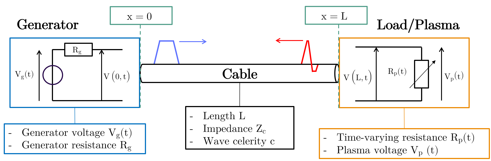

# Welcome to the PyResiFlex documentation

**PyResiFlex** is a simple set of tools in **Py**thon to obtain load (plasma) **Resi**stance from analysis of pulse re**Flex**ions.




```{toctree}
:caption: 'Contents:'
:maxdepth: 2

Installation <installation>
auto_examples/index
API Reference <_api/pyresiflex/index>
References <bibliography>
```

## Indices and tables

- {ref}`genindex`
- {ref}`modindex`
- {ref}`search`

## Note

According to [Oxford Learner's Dictionaries](https://www.oxfordlearnersdictionaries.com/definition/english/reflexion), *reflexion* is an old spelling of *reflection*.
